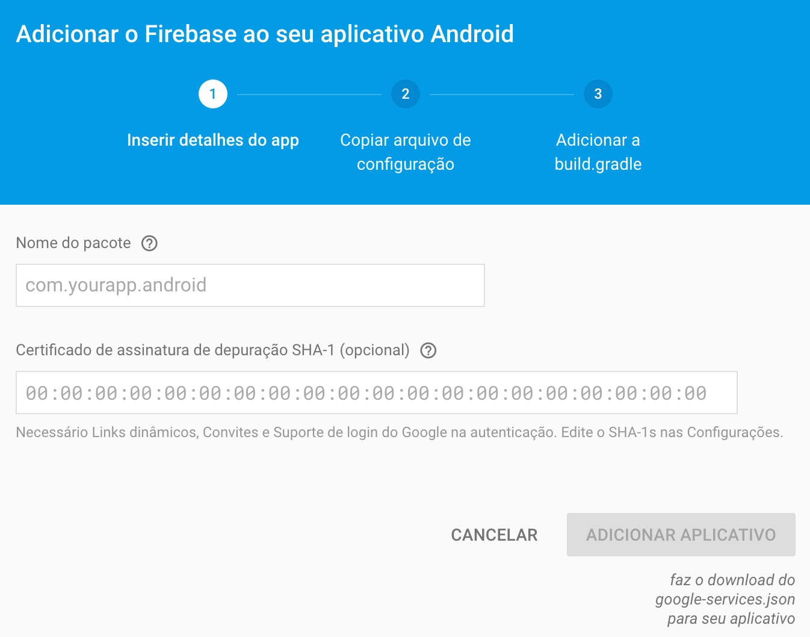
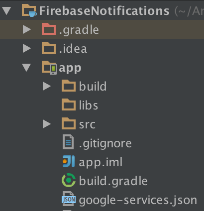
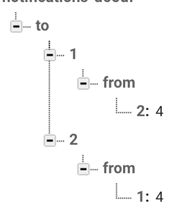

# Service Notifications with Firebase

## Before

[Github firebase](https://github.com/firebase/quickstart-android)

### Firebase

- Create a Firebase project and add a Android App.
 

- Put `google-services.json` file on `app/` root.
 

- Create Data Structure.

